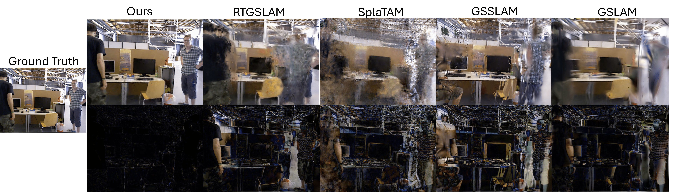

<p align="center">
<h1 align="center"<strong>DynaGSLAM: Real-Time Gaussian-Splatting SLAM for Online Rendering, Tracking, Motion Predictions of Moving Objects in Dynamic Scenes</strong></h1>
  <p align="center">
    <a href='https://blarklee.github.io/' target='_blank'>Runfa Blark Li</a><sup>1,2</sup>
    ·
    <a href='' target='_blank'>Mahdi Shaghaghi</a><sup>2</sup>
    ·
    <a href='' target='_blank'>Keito Suzuki</a><sup>1</sup>
    ·
    <a href='' target='_blank'>Xinshuang Liu</a><sup>1</sup>
    ·
    <a href='' target='_blank'>Varun Moparthi</a><sup>1</sup>
    ·
    <a href='' target='_blank'>Bang Du</a><sup>1</sup>
    ·
    <a href='' target='_blank'>Walker Curtis</a><sup>2</sup>
    ·
    <a href='' target='_blank'>Martin Renschler</a><sup>2</sup>
    ·
    <a href='' target='_blank'>Ki Myung Brian Lee</a><sup>1</sup><br>
    ·
    <a href='' target='_blank'>Nikolay Atanasov</a><sup>1</sup> 
    ·
    <a href='' target='_blank'>Truong Nguyen</a><sup>1</sup>
    <br>
    <sup>1</sup>UC San Diego <sup>2</sup>Qualcomm XR Advanced Technology
    <br>
    <strong>WACV 2026</strong>
    <br>
  </p>
</p>
<p align="center">
  <a href='https://arxiv.org/pdf/2503.11979'>
    </a>
  <a href='https://arxiv.org/pdf/2503.11979'>
    </a>
  <a href='https://blarklee.github.io/dynagslam/'>
    </a>
</p>


<!-- teaser image -->
## 🏠 Overview
<p align="center">
    
</p>
DynaGSLAM is the Gaussian-Splatting (GS) based SLAM for online high-quality rendering of dynamic objects in dynamic scenes. With the online RGBD frames, DynaGSLAM tracks(interpolates)/predicts(extrapolates) the continuous object motions in the past/future, and estimates localization. This figure shows the rendering of GS mapping on TUM dataset with moving people. First row: RGB rendering. Second row: Absolute error between the rendering and the ground truth.

## 📹 Demo
<p align="center">
    
    <br>
    Robust rendering for moving objects compared to SOTA GS SLAM works that could handle statics scenes.
</p>

## Installation
### Environment and Dependencies
Clone the repository first:

```
git clone --recursive https://github.com/BlarkLee/DynaGSLAM_official.git
```

DynaGSLAM has been tested on `python 3.9, CUDA=12.4, pytorch=2.6.0`. The simplest way to install all dependences is to use [anaconda](https://www.anaconda.com/) and [pip](https://pypi.org/project/pip/) in the following steps: 

```bash
conda env create -f environment.yaml
```

Our environment is built upon [RTG-SLAM](https://github.com/MisEty/RTG-SLAM), please refer to their helpful solutions first if running into any environmental issues.

### Dataset Preparation
We use TUM and BONN dataset. Download the dataset sequences from [OMD](https://robotic-esp.com/datasets/omd/), [TUM Dataset](https://cvg.cit.tum.de/rgbd/dataset/) and [Bonn Dataset](https://www.ipb.uni-bonn.de/data/rgbd-dynamic-dataset/index.html), and form the dataset directory as below:

```
|-- data
    |-- OMD
        |--swinging_4_unconstrained
    |-- TUM_RGBD
        |-- rgbd_dataset_freiburg3_walking_xyz
        |-- rgbd_dataset_freiburg3_walking_static
        |-- rgbd_dataset_freiburg3_walking_rpy
        |-- rgbd_dataset_freiburg3_walking_halfsphere
    |-- Bonn_RGBD
        |-- rgbd_bonn_balloon
        |-- rgbd_bonn_balloon2
        |-- rgbd_bonn_person_tracking
        |-- rgbd_bonn_person_tracking2
    
```

### Checkpoint Preparation
Download the optical flow checkpoints [RAFT](https://github.com/princeton-vl/RAFT) and segmentation checkpoints [SAM2](https://github.com/facebookresearch/sam2), and put the checkpoints under the directory:

```
|-- SLAM
    |-- multiprocess
        |-- motion_models
            |-- raft-things.pth
            |-- sam2.1_hiera_base_plus.pt
            |-- sam2.1_hiera_large.pt
            |-- sam2.1_hiera_small.pt
            |-- sam2.1_hiera_tiny.pt
```

## Run
Change the directory of `source_path` and `save_path` of `configs/.yaml`. Our work focuses on the novel mapping part of SLAM, we use [DynoSAM](https://github.com/ACFR-RPG/DynOSAM) to estimate the poses, please refer to [DynoSAM](https://github.com/ACFR-RPG/DynOSAM) to generate the poses. The `source path` should contain RGBD and pose sequences to load, and for the sequences in `TUM dataset`, run:

```
python slam.py --config ./configs/tum/fr3_walking_xyz.yaml
```
<details>
<summary>For other sequences:</summary>

```
python slam.py --config ./configs/tum/fr3_walking_static.yaml
```

or 

```
python slam.py --config ./configs/tum/fr3_walking_rpy.yaml
```

or 

```
python slam.py --config ./configs/tum/fr3_walking_halfsphere.yaml
```

</details>

For the sequences in `BONN dataset`, run:

```
python slam.py --config ./configs/bonn/balloon.yaml
```
<details>
<summary>For other sequences:</summary>

```
python slam.py --config ./configs/bonn/balloon2.yaml
```

or 

```
python slam.py --config ./configs/bonn/person_tracking.yaml
```

or 

```
python slam.py --config ./configs/bonn/person_tracking2.yaml
```

</details>

For the sequences in `OMD dataset`, run:
```
python slam.py --config ./configs/omd/swinging_4_unconstrained.yaml
```

## Acknowledgement
We use 3DGS code from the original [3DGS](https://github.com/graphdeco-inria/gaussian-splatting) and [RTG-SLAM](https://github.com/MisEty/RTG-SLAM), and localization from [DynoSAM](https://github.com/ACFR-RPG/DynOSAM). We appreciate the contribution of these previous works. 

## Citation
If you find our work useful for your research, please cite
```
@misc{dynagslam,
      title={DynaGSLAM: Real-Time Gaussian-Splatting SLAM for Online Rendering, Tracking, Motion Predictions of Moving Objects in Dynamic Scenes}, 
      author={Runfa Blark Li and Mahdi Shaghaghi and Keito Suzuki and Xinshuang Liu and Varun Moparthi and Bang Du and Walker Curtis and Martin Renschler and Ki Myung Brian Lee and Nikolay Atanasov and Truong Nguyen},
      year={2025},
      eprint={2503.11979},
      archivePrefix={arXiv},
      primaryClass={cs.CV},
      url={https://arxiv.org/abs/2503.11979}, 
}
```
or 

```
@inproceedings{dynagslam,
    author = {Li, Runfa Blark and Shaghaghi, Mahdi and Suzuki, Keito and Liu, Xinshuang and Moparthi, Varun and Du, Bang and Curtis, Walker and Renschler, Martin and Lee, K. M. Brian and Atanasov, Nikolay and Nguyen, Truong},
    title = {DynaGSLAM: Real-Time Gaussian-Splatting SLAM for Online Rendering, Tracking, Motion Predictions of Moving Objects in Dynamic Scenes},
    booktitle = {Proceedings of the IEEE/CVF Winter Conference on Applications of Computer Vision (WACV)},
    year = {2026},
}
```